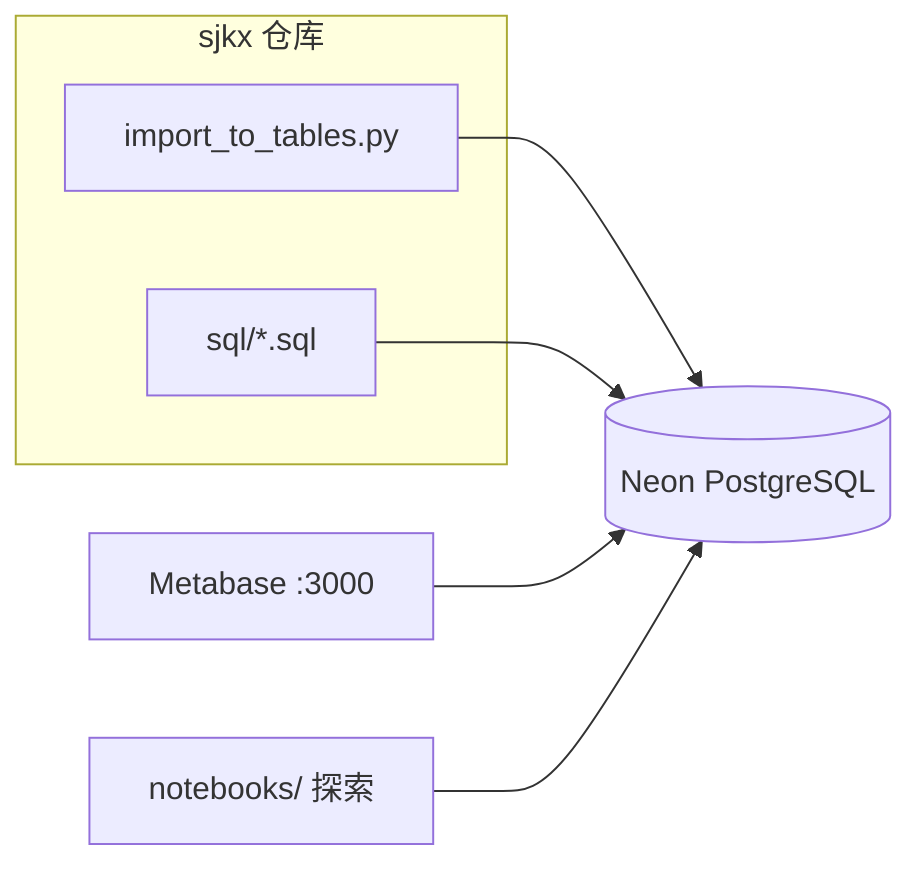

# Metabase 分析前端

sjkx 选定 **[Metabase](https://github.com/metabase/metabase)** 作为数据分析网页端：独立部署、直连 Neon，复用 `sql/` 对照逻辑，不在本仓库内维护 React/BI 代码。

## 为何选 Metabase

| 维度 | 说明 |
|------|------|
| 与架构 | 符合 `CONTEXT.md`：数据在 Neon + `sql/`，前端由专用 BI 承担 |
| 数据源 | 官方支持 PostgreSQL，与 Neon pooler 兼容 |
| 对照分析 | 原生 SQL + 日期变量 `{{anchor_date}}`，对应锚定 `snapshot_date` |
| 上手 | Docker 一条命令；非开发也能建仪表盘 |
| 未选 Superset | 功能更强但 Compose 依赖多（Redis、Worker），运维更重 |
| 未选 Evidence | 适合「报表即代码」，需另建 Evidence 项目并改写 SQL 结构 |
| 未选 Streamlit | 要在仓库写 Python 页面，接近自研前端 |

协议：Metabase 开源版为 **AGPL**。仅内网自用、不对外分发修改版时，一般可自托管；若对外提供 SaaS 或嵌入产品，需核对许可。

## 分工



- **导入**：`scripts/import_to_tables.py`
- **探索**：`notebooks/sjkx_analysis.ipynb` 或 `scripts/db_query.py`
- **固定看板 / 给业务看的页面**：Metabase

## 本地启动 Metabase

```bash
cd /Users/lanse/Documents/sjkx
docker compose -f docker-compose.metabase.yml up -d
```

浏览器打开 http://localhost:3000 ，按向导创建管理员账号。

### Docker 报错 `500 Internal Server Error`（docker.sock）

说明 **Docker 引擎未正常响应**（与 Metabase 镜像无关）。可先自检：

```bash
docker version
```

若 `Server` 一段也报 500，按顺序尝试：

1. 打开 **Docker Desktop**，等到状态为 **Engine running**（绿点）
2. Docker Desktop → **Troubleshoot** → **Restart Docker Desktop**
3. 仍失败：**Quit Docker Desktop** 后重新打开；或 **Clean / Purge data** 后重启（会清空本地镜像缓存）
4. 确认磁盘空间充足；将 Docker Desktop 升级到最新版

`docker version` 正常后再执行 `docker compose -f docker-compose.metabase.yml up -d`。

### 不用 Docker 时（引擎修不好期间）

**方式 A — Metabase Cloud**（免本地 Docker）：https://www.metabase.com/cloud ，添加 Neon 数据源，SQL 仍用 `sql/metabase/`。

**方式 B — JAR 本地运行**（需本机 Java 21+）：

```bash
curl -Lo metabase.jar https://downloads.metabase.com/latest/metabase.jar
java -jar metabase.jar
```

浏览器访问 http://localhost:3000 ，连接 Neon 步骤同上。

停止：

```bash
docker compose -f docker-compose.metabase.yml down
```

## 连接 Neon

1. Metabase → **Admin** → **Databases** → **Add database** → **PostgreSQL**
2. 填写 `database.env` 中信息（推荐 **只读** 账号，仅 `SELECT` on `"F"` / `"R"` / `"V"`）
3. 连接方式二选一：
   - **Host / Port / DB name / User / Password**（从 URI 拆开）
   - 或 **Use a connection URI**（粘贴完整 `DATABASE_URL`，含 `sslmode=require`）

Neon 控制台可为 Metabase 单独建 role，避免 BI 工具使用导入脚本的写权限。

## 创建对照问题（Question）

Metabase → **New** → **SQL query** → 选择 Neon 数据库 → 粘贴 `sql/metabase/` 下文件内容。

| 文件 | 用途 | 变量 |
|------|------|------|
| `sql/metabase/shop_comparison.sql` | F 锚定 → R 两两对照 | `anchor_date`：**Date**，选 F 表存在的日期 |
| `sql/metabase/vestiaire_reference_comparison.sql` | V 锚定 → F、R 三方参照 | `anchor_date`：**Date**，选 V 表存在的日期 |

保存后 Metabase 会提示添加变量：将 `anchor_date` 设为 **Date**，必填。

逻辑源文件仍为 `sql/shop_comparison.sql` 与 `sql/vestiaire_reference_comparison.sql`（psql / Python 用）；**修改配对规则时两处须同步**。

## 仪表盘建议

新建 Collection「竞品对照」，包含：

1. **快照自检** — 简单 SQL：`SELECT snapshot_date, COUNT(*) FROM "F" GROUP BY 1 ORDER BY 1 DESC LIMIT 20`（R、V 各一张表或合并）
2. **F 对 R 对照** — 上表 + `shop_comparison` 问题，筛选器绑定 `anchor_date`
3. **V 三方参照** — `vestiaire_reference_comparison` 问题；图表按 `currency` 分组（V 多币种）

图表类型：表格 + 条形图（如 `brand` × `f_avg_price` / `r_avg_price`）。

## 使用注意

- **最近邻 ±3 天**：锚定日若在 R 表无邻近快照，两两对照可能为空 → 先 `python3 scripts/db_query.py summary` 或补导 R。
- **汇率**：跨币种统一 CNY 尚未实现；V 结果按 `currency` 解读。
- **AGPL**：若将 Metabase 嵌入对外产品，需法务评估；内部分析通常自托管即可。

## 生产（可选）

- [Metabase Cloud](https://www.metabase.com/cloud) 免运维
- 自托管时 Metabase **应用库**（存仪表盘元数据）应用 Postgres，勿仅用容器内 H2；见 [官方 Docker 文档](https://www.metabase.com/docs/latest/installation-and-operation/running-metabase-on-docker)
